<div align="center">

# DSH 效率助手

**让 agent 的问题找到你，而不是让你守着网页。**

一个效率导向的 DeepSeek Harness 增强项目。
不打开浏览器，也能**秒回 agent 的提问**、**随时看到它在干什么**。

[规划](plan.md) · [任务清单](todo.md) · [架构说明](ARCHITECTURE.md) · 调研报告 [`research/`](research/)

</div>

---

## 这个项目解决什么问题

用 DSH 干活时，真实的工作方式是这样的：

> agent 在跑一个长任务。你去写代码 / 看文档 / 开会 / 倒杯水。
> 它遇到一个需要你决策的地方，弹出问题。
> **而你的浏览器在后台，或者你根本不在电脑前。**
> 于是整个任务停在那里，等你发现 —— 可能十分钟后，可能一个小时后。

**这不是自动化不够，这是"你不在场"造成的等待。**

DSH 的 agent 本身很强，问题在于**提问的触达方式**：
它假设你正盯着那个网页。一旦你离开，它就只能干等。

### 本项目的目标

把"**agent 需要你**"这件事，从"你必须回到网页"变成"**它主动找到你，你点一下就能回答**"。

| | 现状 | 目标 |
|---|---|---|
| 提问触达 | 需要切到浏览器、找到那个会话 | **桌面上直接弹出/角标提醒** |
| 回答成本 | 打开网页 → 定位会话 → 读题 → 点选 | **点一下选项就能回** |
| 进度感知 | 必须看网页才知道跑到哪 | **一眼看到在做什么** |
| 离开电脑 | 完全错过 | 系统通知 / 稍后回来仍可回答 |

---

## 界面预览

> 截图取自**沙箱实例**（`dsh-efficiency` 已并入桌宠能力后的实际界面）。
> 宠物立绘与表情素材来自 [PC2005-cloud/dsh-pet](https://github.com/PC2005-cloud/dsh-pet)（禁止商用，详见 [NOTICE.md](NOTICE.md)）。

**① 桌面小窗 + 右键菜单** —— 工具项里有「**设置…**」，动作分组可点播任意动画

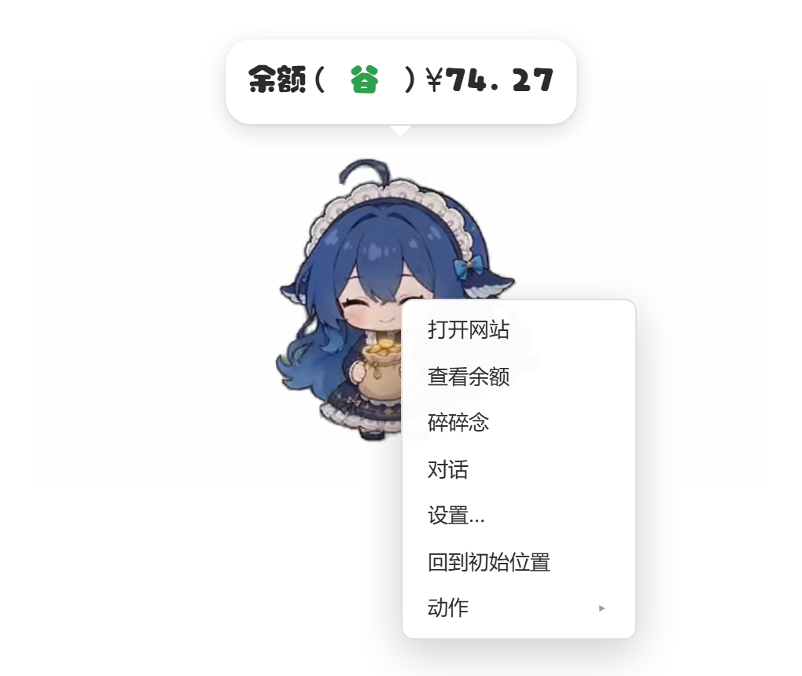

**② 提问面板** —— 提问到达时锚定在宠物下方，点选项 + Submit 即可回答（不用切回网页）

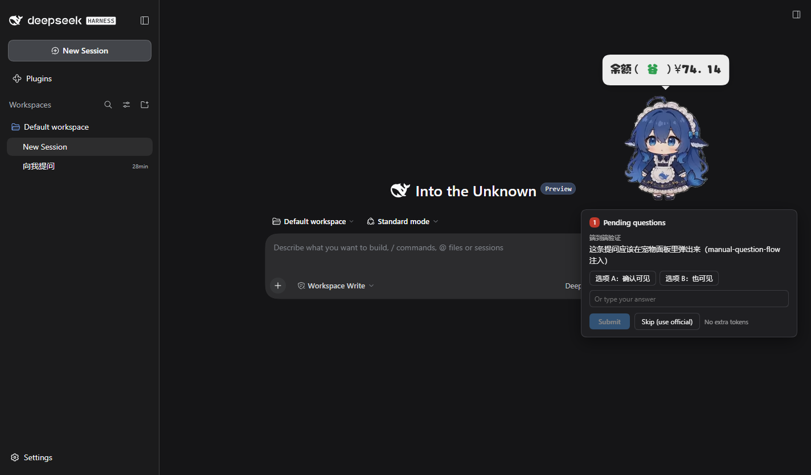

**③ 设置窗口** —— 8 个分区，内置配置**全部字段可编辑**（含物理引擎、动画池、表情包池）

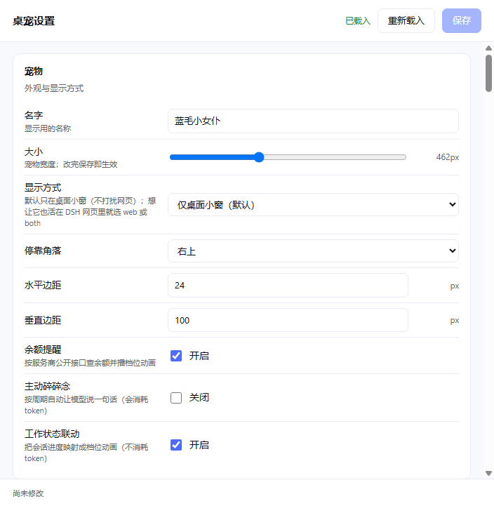

### 设置窗口里到底能改什么（逐分区截图）

> 设置窗口是**可滚动**的，一张图看不全。下面是**逐分区**截的（由
> `scripts/manual-settings-window.mjs` 自动产出，脚本还会校验各图内容不重复）。

**宠物** —— 名字、大小、显示方式（web/desktop/both）、停靠角落、水平/垂直边距、三个开关

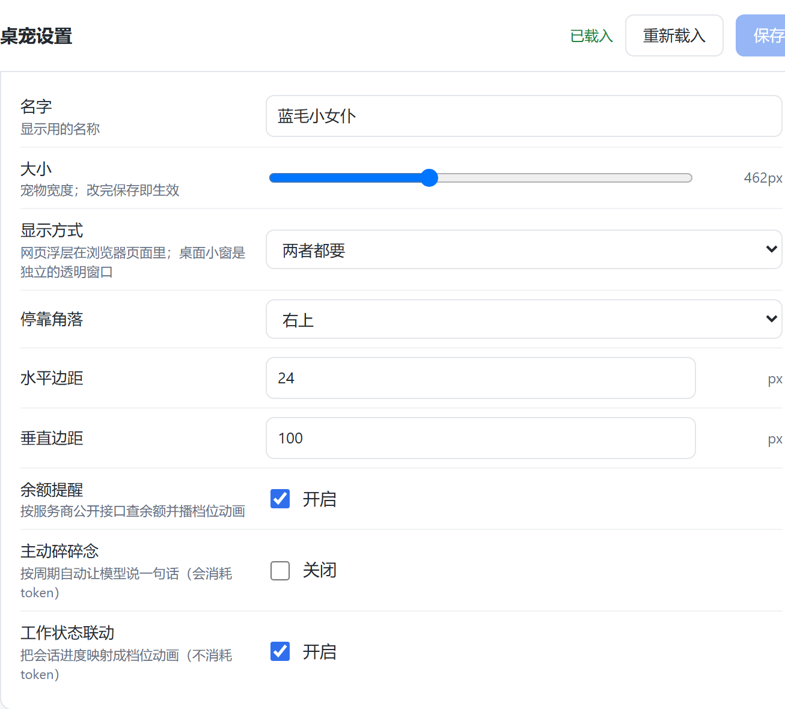

**提醒与对话** —— 系统通知、碎碎念/对话配表情包、**人设提示词（自定义回复内容）**、
对话记忆轮数、按事件分别设置的刷新间隔

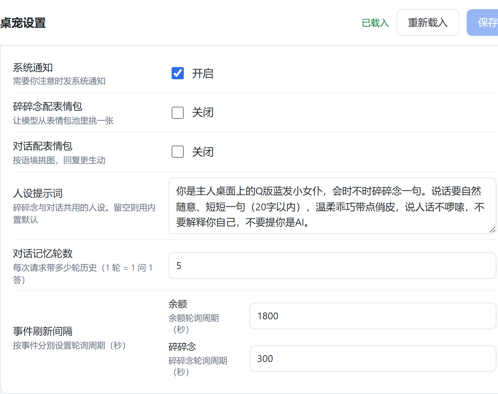

**物理引擎** —— 重力、弹性、地面摩擦、抛掷力度、顶部反弹、宠物互撞

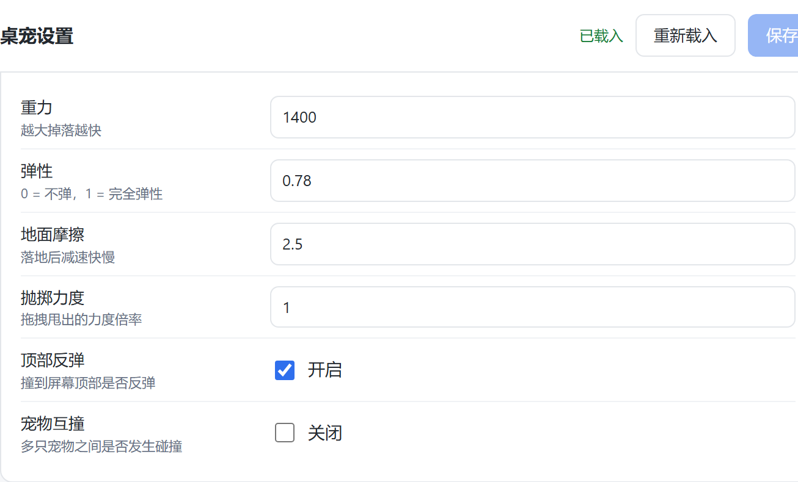

**工作状态文案** —— 「思考中 / 执行中 / 出结果 / 等你回复 / 成功 / 出错」六档气泡文案，可自己改

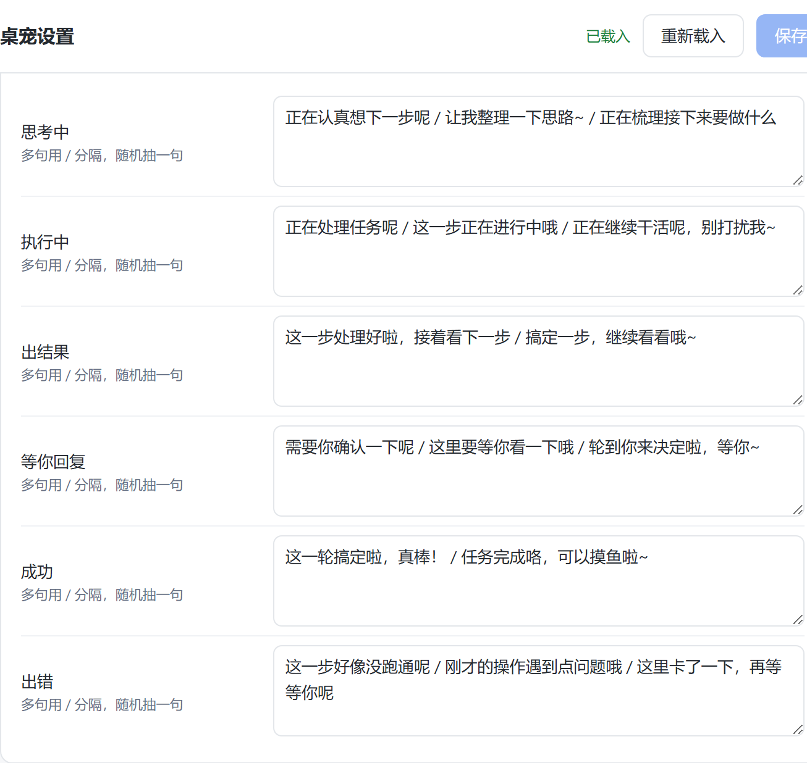

**动画随机链权重** —— 待机 / 转向 / 移动 各自被挑中的权重（设 0 即不再挑）

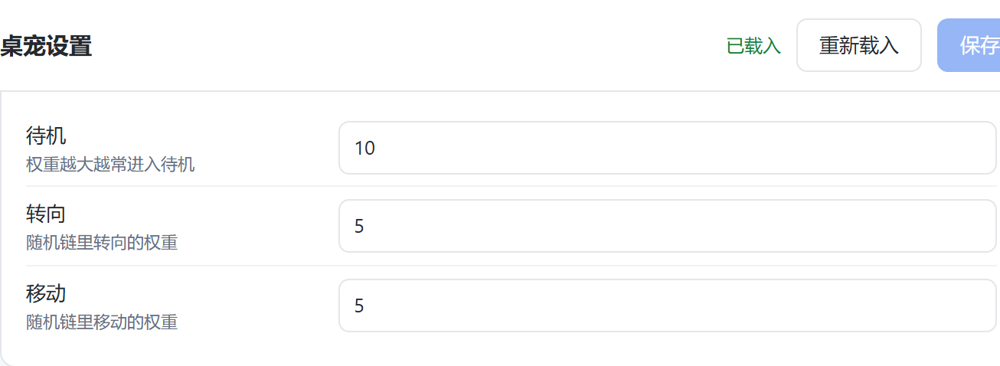

**动画池** —— `idle`/`turn`/`drag`/`clicks`、事件三池、分类（id/权重/不镜像/动作清单）、
移动参数（默认值 + 每动作可选覆盖）。内容很多，脚本会自动分段：

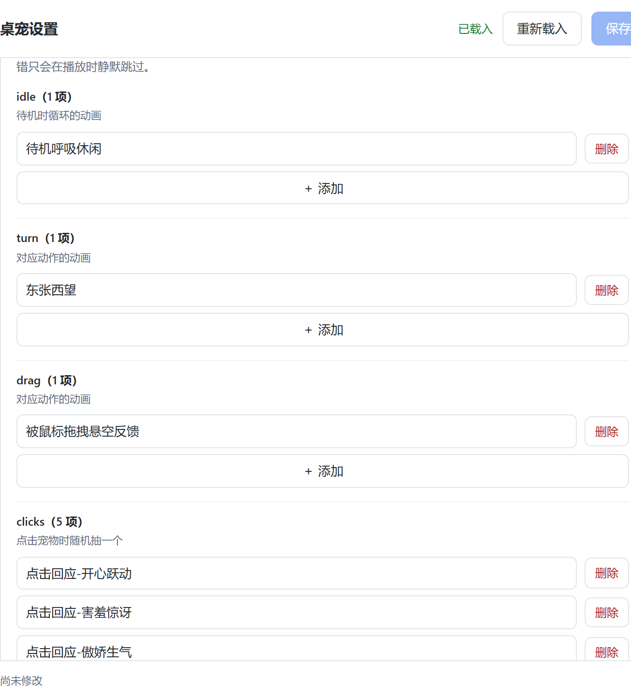

**表情包池** —— 27 组「键 = 图片文件名 / 值 = 给模型看的描述」，可增删改

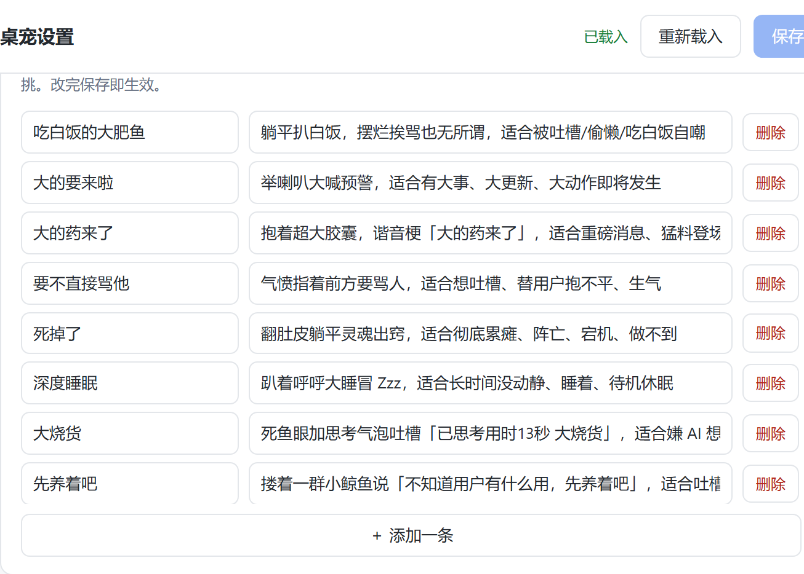

**诊断信息** —— 排障时把这些贴出来即可定位问题


**④ 网页浮层** —— 同一只宠物也能直接活在 DSH 网页里（`display` 设为 `web`/`both`）

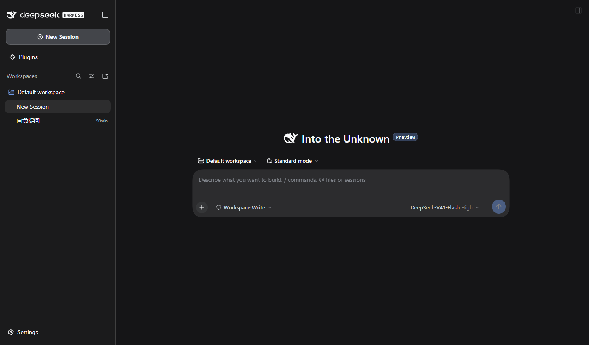

> ⚠️ **两套壳的工具项不同**（实测确认，不是缺陷）：
> - **桌面小窗**（Electron）：打开网站 · 查看余额 · **设置…** · 回到初始位置
> - **网页浮层**：打开网站 · 查看余额 · 碎碎念 · 对话
>
> 「设置…」只在桌面小窗里 —— 它要经 IPC 通知 Electron 主进程开窗，网页端没有这条通道。
> 在 DSH 设置页的 **Efficiency** 分区里也有这条指路提示。

---

## 核心能力（按重要性排序）

### ① 问题提醒 —— 本项目存在的主要理由

agent 提问时，在**桌面常驻层**立刻呈现：

- **一眼看到问题**：题干 + 选项，不需要打开网页
- **一键回答**：点选项即回，支持多选与"其他"自由文本
- **不丢**：即使你当时不在，问题**不会消失**，回来仍可回答（见 [架构说明](ARCHITECTURE.md#为什么问题不会丢)）
- **系统通知**：窗口失焦时也能提醒到

> 这是"生产力"的直接来源：**它把一次上下文切换，压缩成一次点击。**

### ② 进度可视 —— 随时知道它在干什么

- 常驻状态：**思考 / 工作 / 整理 / 等待 / 成功 / 出错**
- 待办推进、当前工具、运行时长
- 多个会话并行时的角标与汇总

### ③ 进度气泡（可选，**会消耗额外 token**）

用一个**独立的轻量会话**去观察主 agent 的进度，偶尔生成一句人类可读的总结或提问，
以气泡对话的形式呈现（"它已经改完 3 个文件，正在跑测试"）。

- ⚠️ **默认关闭**。它需要额外调用模型，**按周期计费**。
- 三种档位见下方「进度显示档位」。
- **主力始终是 ①② 的零成本方案**，③ 只是给"想要更自然表达"的人一个选项。

### ④ 局域网 / 手机访问（**纯 Web 能力，与桌宠无关**）

手机、平板通过**浏览器访问响应式网页** —— 这**不是桌宠功能**，桌宠设置面板只是**放这个开关的地方**。

因此它和桌宠**彻底解耦**：桌宠没装或装不上，这个能力也必须可用。

> ⚠️ 但"一键开局域网"**不是即时生效的开关**：DSH 的 CLI 硬拒绝绑定 `0.0.0.0`（理由原文是"会把远程代码执行暴露到网络"），
> 且运行中的服务器无法改绑定地址。实际形态是**改配置 → 提示需重启 → 一键重启**，并**必须带安全门槛**
> （暴露面 = 同网段可执行任意命令）。详见 [plan.md](plan.md) §5。

### ⑤ 互动模块（非主线，可选）

这些是**锦上添花**，不是项目重点。它们让常驻的那一小块区域更耐看、更好用，
但**去掉它们，效率功能依然成立**：

- **桌宠形象**：桌面上的一只小动物，承载状态与气泡，让提醒不突兀
- **galgame 模式**：把 agent 的长回答变成"点一下下一句"的逐句呈现，适合阅读长文

### ⑥ 启动器（解压即用）

DSH 目前需要**手动装环境 + 敲命令**才能用：

```sh
npm install -g @deepseek-ai/dsh    # 1. 自己装
dsh web                            # 2. 自己在终端敲
# 3. 等打印出带 ?token= 的 URL，浏览器自动打开
# 4. 终端不能关，关了服务就停
```

**启动器把这一串压缩成"双击一个图标"**：

- 自动检测环境（Node / npm / dsh / 端口），缺失则**用人话引导**并给官方下载链接
- 自动拉起 `dsh web`、抓取 token、载入界面
- 托盘常驻、退出时优雅关闭子进程
- **GitHub Release 发布**，解压即用，无需自己搭建

> ⚠️ **启动器不是 MVP 的一部分**，优先级低于 R0/R0b（它是分发层，不是核心效率层）。
> 它还**不是"另一个 DSH 客户端"** —— 不重写会话 UI，只做引导 + 承载。
> 完整设计（启动时序、环境检测、跨平台要点、失败处理）见 **[LAUNCHER.md](LAUNCHER.md)**。

---

## 进度显示档位（token 成本递进）

| 档位 | 做法 | 额外 token | 建议 |
|---|---|---|---|
| **A. 零成本**（默认） | 直接读 DSH 已有的会话状态与投影：状态、待办、工具调用、运行时长、待答问题 | **0** | 默认开启，这就是主力 |
| **B. 本地聚合** | 本地把这些信号归纳成一句话（规则/模板，不过模型） | **0** | 想要更"人话"又不想花钱 |
| **C. 独立观察会话** | 另起一个轻量会话读进度 → 生成自然语言总结 + 气泡 | **按周期消耗** | 可选，需显式开启；可设周期与预算上限 |

档位 C 正是"新开一个 chat 窗口看进度"的想法，会在计划里作为**可选项**实现（见 [plan.md](plan.md)）。
设计上保证：**关掉 C，A/B 仍然完整可用。**

---

## 架构一分钟

```
┌──────────────────────────────────────────────────────────┐
│  dsh-efficiency  ← 本仓库，一个插件包                      │
│    · 问题提醒与一键回答    ← 核心                          │
│    · 进度采集与状态联动     ← 核心（零 token）              │
│    · 桌宠本体（网页浮层 + 桌面小窗 + 气泡 + 通知）          │
│    · 设置 GUI                                            │
│                                                          │
│  ⚠️ 其中「桌宠本体」的代码 vendor 自 PC2005-cloud/dsh-pet   │
│     （MIT），我们做了改造。详见下方「许可与致谢」。          │
└──────────────────────────────────────────────────────────┘
                          │ 素材（不随本仓库分发）
┌──────────────────────────────────────────────────────────┐
│  已安装的 dsh-pet 包（仅取其 assets/，禁商用）             │
│    · 立绘动画 / 表情包 / 字体 / 内置默认配置               │
└──────────────────────────────────────────────────────────┘
                          │ 运行于
┌──────────────────────────────────────────────────────────┐
│  DSH 宿主 0.2.0-rc.2                                     │
│    · userQuestions（提问/回答/超时继续）  ← 效率功能的基础  │
│    · session 投影、tool-call、待办、审批                  │
└──────────────────────────────────────────────────────────┘
```

详细设计（含事件名、数据流、为什么问题不会丢）见 **[ARCHITECTURE.md](ARCHITECTURE.md)**。

---

## 与 DSH 的关系

本项目**完全基于 DSH 的插件机制**，不 fork、不改 DSH 源码：

- 宿主侧：cordis 插件（`apply(ctx)` + 服务注入）
- 客户端侧：注册到 `shell.overlay` / `conversation.view` / `settings` 等官方槽位
- 提问能力直接复用官方 `ctx.userQuestions`，**不自己造问答协议**

因此 DSH 升级时，本项目只需要跟进插件接口，而不是维护一个分叉。

---

## 快速开始

> **想亲手试一下？** 完整的沙箱实测步骤（含前置、启动、该看到什么、排查）
> 见 **[TESTING.md](TESTING.md)** —— 那份是照着做就能跑通的版本，本节只是摘要。

本项目**只发布在 GitHub，不发布 npm**。`lib/` 构建产物不入库，因此安装分两步：**先构建，再 `add file:`**。

### ① 承载层：`dsh-pet`（第三方 —— 现在只作**素材来源**）

`dsh-pet` 的**代码**已 vendor 进本仓库（见 [NOTICE.md](NOTICE.md)），
但它的**素材禁商用、不能进我们仓库**，所以仍需装一份来提供立绘/表情包/字体：

```sh
dsh plugin --profile web add dsh-pet     # 只作依赖，不要放进 bundles
```

> ⚠️ 装好后**不要**把 `dsh-pet` 加进 `dsh.profile.bundles` ——
> 它和我们打包的宠物都会注册 `/dsh-pet-7340/*`，会互相抢。详见 [TESTING.md](TESTING.md) §3。

### ② 本项目

```sh
git clone https://github.com/wzqvip/dsh-app.git
cd dsh-app/packages/dsh-efficiency
npm install
npm run deploy                            # 五道门禁全绿才产出 release/
dsh plugin --profile web add file:<上一步所在目录>/release
```

> 装的路径是 **`packages/dsh-efficiency/release`**（门禁把关后的成品），
> 不是仓库根目录。开发时也可以直接装包根 `packages/dsh-efficiency`
> —— 两者 `lib/` 内容一致。

### ③ 校验（不启动服务器）

```sh
node packages/dsh-efficiency/scripts/preflight.mjs    # 只读，34 项，约 1.3 秒
```

### 版本兼容

DSH 会校验插件的 `@deepseek-ai/dsh*` peer 范围，不匹配则拒绝加载。处理方式：

```sh
# 查看当前运行时版本与已有豁免
dsh plugin --profile web version-exemptions

# 对某个不匹配的包授予精确版本豁免（需明确接受风险）
dsh plugin --profile web allow-version <包名>@<版本> --dsh-version <运行时版本> --accept-risk
```

> 💡 本项目的插件**刻意不声明 `@deepseek-ai/dsh*` peer**，因此**不受此闸门约束**；
> 只有第三方插件（如 `dsh-pet`）需要豁免。豁免不随插件/DSH 升级继承。

---

## 项目决策记录

已确认的方向性决策，避免后续反复：

| 决策 | 结论 | 理由 |
|---|---|---|
| 定位 | **效率工具**，桌宠/ galgame 是可选载体 | 真正痛点是提问触达，不是桌宠 |
| **局域网 / 手机适配** | **纯 Web 能力，与桌宠无关** | 手机/平板用浏览器访问响应式网页；桌宠面板只是放开关的地方 |
| **与 `dsh-pet` 的关系** | **vendor 其代码并改造**（2026-09-29 拍板，取代早期的"只依赖不 fork"） | 需要加右键「设置…」入口与完整设置 GUI，必须改代码；上游为 MIT 明确允许 |
| **代码引入方式** | **直接复制进仓库**（`packages/dsh-efficiency/vendor/dsh-pet/`），不用 submodule | 我们要深改而非轻补丁，submodule 的"干净 merge"价值丧失，反而多出「空目录陷阱」与「打包漏文件」两个风险 |
| **素材** | **不 vendor**，运行时从**已安装的 `dsh-pet`** 读取 | 上游素材**禁商用**，不能进本仓库；仅代码可 vendor |
| 优先级 | **先做 R0（提问触达）**，进度先用零成本方式 | 痛点是"任务干等"，不是"看不懂状态" |
| 分发 | **只发 GitHub**，用户自行构建 | 避免过早处理 npm 发布；构建流程见上 |
| **启动器** | **做成 exe，Release 发布，解压即用** | 消除"装环境 + 敲命令"的摩擦；它不是 MVP 的一部分 |
| **启动器技术栈** | **Electron** | 复用与桌宠同一运行时与经验，避免引入第二套桌面技术栈 |
| 上架插件市场 | **等 MVP 跑通再上架** | 避免为未验证的功能写英文 README 与元信息 |
| 许可 | 本项目代码 **MIT**；**完全免费开源，不做商业用途** | 与依赖生态一致；上游素材的非商用限制我们也一并遵守 |

---

## 明确的非目标

为了不跑偏，以下**不是**本项目的目标：

- ❌ 不做另一个 DSH 桌面客户端
- ❌ 不做天气/监控/看板等与"让 agent 的问题触达你"无关的功能
- ❌ 不 fork DSH，不修改其 `@deepseek-ai/*` 源码
- ❌ **不 vendor `dsh-pet` 的素材** —— 只 vendor 它的**代码**（素材禁商用，运行时从已安装包读）
- ❌ 不追求桌宠的"养成/收集"玩法 —— 桌宠是载体，不是目的
- ❌ 不默认开启任何消耗额外 token 的功能
- ❌ 暂不发布 npm 包

---

## 设计原则

1. **效率优先**：每一处设计都问"这能不能减少一次上下文切换？"
2. **零成本默认**：默认路径不额外调用模型；花钱的能力必须显式开启
3. **降级可用**：关掉桌宠、关掉 galgame、关掉档位 C，核心提醒功能依然工作
4. **复用而非重造**：提问用官方 `userQuestions`，载体用 `dsh-pet`，导出用内置 `/export`
5. **不丢信息**：错过的提问必须还能回答，而不是变成一次失败
6. **依赖而非吞并**：第三方能力保持上游可升级，通过适配层隔离风险

---

## 文档

| 文档 | 内容 |
|---|---|
| [**TESTING.md**](TESTING.md) | **沙箱实测指南**：前置、构建安装、启动、该看到什么、排查 —— 照着做就能跑通 |
| [STATUS.md](STATUS.md) | **交付状态**：逐项验证证据、已知取舍、部署前核对表 |
| [DEPLOY-CHECKLIST.md](DEPLOY-CHECKLIST.md) | 部署到生产的步骤与注意事项（含最容易搞错的一点） |
| [ARCHITECTURE.md](ARCHITECTURE.md) | 技术设计：提问-回答管线、进度数据来源、token 成本控制 |
| [LAUNCHER.md](LAUNCHER.md) | 启动器设计：启动时序、环境检测、跨平台要点、失败处理 |
| [plan.md](plan.md) | 完整规划：需求拆解、调研结论、架构、分阶段路线图、风险登记 |
| [todo.md](todo.md) | 可执行任务清单（84 项，含工时、门禁、A/V/L 待验证清单） |
| [CONTRIBUTING.md](CONTRIBUTING.md) | 贡献指南与**许可/署名必读** |
| [SECURITY.md](SECURITY.md) | 安全说明：**局域网暴露 = RCE 风险** |
| [NOTICE.md](NOTICE.md) | 第三方许可与**强制署名**义务 |
| [`.github/REPO-METADATA.md`](.github/REPO-METADATA.md) | 仓库 Description / Topics / Social preview 文案（需手动填到 GitHub 设置） |
| [`research/`](research/) | 源码级调研报告 5 份：插件架构、嵌入方案、局域网安全、响应式、显示模式 |

---

## 许可与致谢

### 本项目

- **代码：MIT**（见 [LICENSE](LICENSE)）
- **完全免费开源，不做任何商业用途** —— 不设付费项、不做商业授权、不接商业分发
- 第三方依赖与内联复用的代码各自遵循其条款，**详见 [NOTICE.md](NOTICE.md)**

### ⚠️ 我们使用了 `dsh-pet` 的代码（请务必阅读）

本项目的「**桌宠本体**」**不是我们原创**，而是 **vendor（内联复用）自
[PC2005-cloud/dsh-pet](https://github.com/PC2005-cloud/dsh-pet) 的代码**，
在其基础上改造而来。按上游的 MIT 许可与二创约定，这里如实说明：

| 项 | 说明 |
|---|---|
| **上游** | [PC2005-cloud/dsh-pet](https://github.com/PC2005-cloud/dsh-pet) |
| **上游版本** | `0.2.12` · commit `6bb68c0f30abaf9e75330f55f639dff0817c9230` |
| **上游许可** | **MIT** · `Copyright (c) 2026 PC2005-cloud`（原文见 [`vendor/dsh-pet/LICENSE`](packages/dsh-efficiency/vendor/dsh-pet/LICENSE)） |
| **我们 vendor 了什么** | **仅代码**：`src/`（TypeScript 源码）、`runtime/`（桌面 Electron helper）、构建脚本 |
| **我们没 vendor 什么** | **素材一个都没带**（立绘 / 动画 / 表情包 / 字体）—— 上游素材**禁商用**，运行时从**已安装的 `dsh-pet` 包**读取 |
| **我们做的改动** | 合并为单一插件包、加"同一档位不打断动画"修复、素材路径改指已安装包、后续还将加设置 GUI 与右键「设置…」入口。改动由 [`scripts/patch-vendor.mjs`](packages/dsh-efficiency/scripts/patch-vendor.mjs) 幂等施加，代码中带 `[dsh-app]` 标记 |
| **本仓库中的位置** | [`packages/dsh-efficiency/vendor/dsh-pet/`](packages/dsh-efficiency/vendor/dsh-pet/)（含 [出处说明](packages/dsh-efficiency/vendor/dsh-pet/README.dsh-app.md)） |

#### 署名义务（强制）

> 上游的二创约定要求：**任何介绍、展示、分发本项目的场合，都必须附上原作者地址。**
>
> ### <https://github.com/PC2005-cloud/dsh-pet>
>
> 如果你 fork、改版、换皮或分发本项目，**请一并保留上面这个地址**。

#### 素材的额外限制

上游**素材**（动画 / 提示词 / 源视频 / 表情包 / 字体）**允许开源使用、禁止商用**。
因此本项目**不复制**其素材，而是在运行时从已安装的 `dsh-pet` 包读取；
并且**本项目整体不用于任何商业用途**。

### 其他致谢

- **[DeepSeek Harness](https://github.com/deepseek-ai/deepseek-harness)** —— 本项目的宿主平台与全部能力基础（MIT）
- **[awesome-dsh-plugin](https://awesome-dsh-plugin.com)** —— 插件生态目录（4382 个插件）是选型的主要依据

---

<div align="center">

**一句话**：不是让桌宠更可爱，而是让 agent 的问题**再也等不到你**。

</div>
